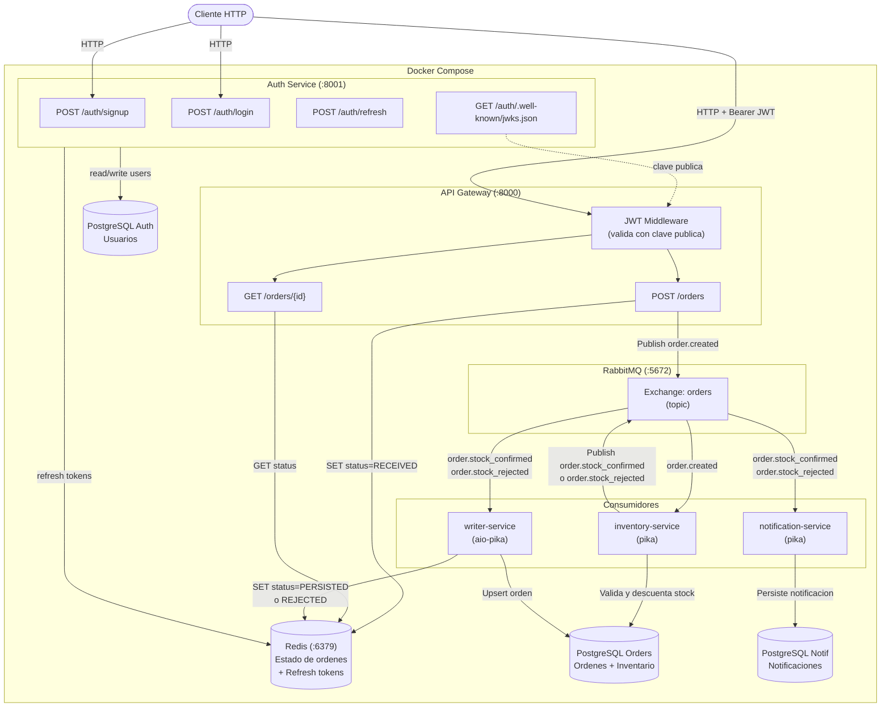
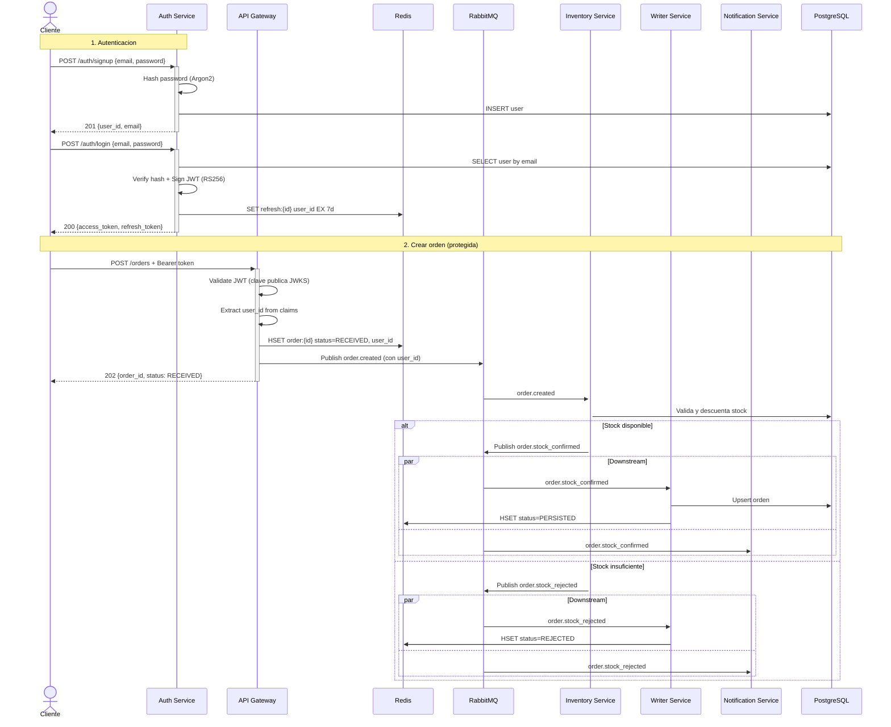
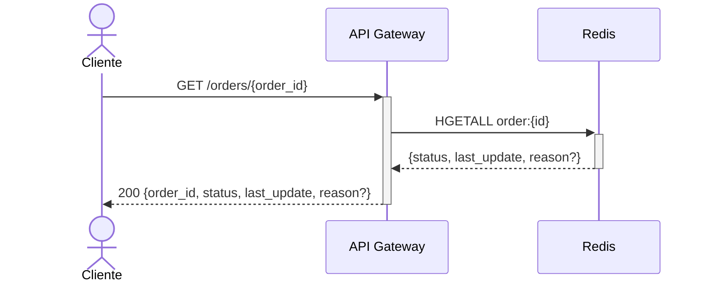

# Procesamiento Distribuido de Ordenes con RabbitMQ

Sistema event-driven de procesamiento de ordenes que utiliza **FastAPI**, **RabbitMQ**, **PostgreSQL** y **Redis**. Un API Gateway autenticado recibe ordenes por HTTP, valida el JWT del usuario, publica eventos a un exchange topic de RabbitMQ, y los consumidores procesan el evento mediante encadenamiento — `inventory-service` valida stock primero, y los servicios downstream reaccionan segun el resultado.

## Diagrama de componentes



## Diagrama de secuencia

### Autenticacion y creacion de orden



### Consultar estado (GET /orders/{id})



**Ciclo de vida del estado:** `RECEIVED` → `PERSISTED` | `REJECTED` (stock insuficiente) | `FAILED` (error en BD)

## Requisitos previos

- [Docker](https://docs.docker.com/get-docker/) y Docker Compose

## Inicio rapido

```bash
# 1. Clonar el repositorio
git clone <url-del-repo>
cd rabbitmq-orders-distributed

# 2. Crear archivo de variables de entorno
cp .env.example .env

# 3. Levantar todos los servicios
docker compose up --build
```

## Uso

### Registrar usuario y obtener token

```bash
# Signup
curl -X POST http://localhost:8001/auth/signup \
  -H "Content-Type: application/json" \
  -d '{"email": "ana@example.com", "password": "SecureP4ss!"}'

# Login
curl -X POST http://localhost:8001/auth/login \
  -H "Content-Type: application/json" \
  -d '{"email": "ana@example.com", "password": "SecureP4ss!"}'
```

Respuesta del login:

```json
{
  "access_token": "eyJhbGciOiJSUzI1NiIs...",
  "refresh_token": "a72a94cf-efb6-4987-...",
  "token_type": "bearer"
}
```

### Crear una orden (requiere autenticacion)

```bash
curl -X POST http://localhost:8000/orders \
  -H "Content-Type: application/json" \
  -H "Authorization: Bearer <access_token>" \
  -d '{"customer": "Ana", "items": [{"sku": "LAP-001", "qty": 1}]}'
```

Respuesta (HTTP 202):

```json
{
  "order_id": "f47ac10b-58cc-4372-a567-0e02b2c3d479",
  "status": "RECEIVED"
}
```

### Consultar estado de una orden

```bash
curl http://localhost:8000/orders/{order_id}
```

Respuesta (orden exitosa):

```json
{
  "order_id": "f47ac10b-58cc-4372-a567-0e02b2c3d479",
  "status": "PERSISTED",
  "last_update": "2026-03-18T12:00:00+00:00",
  "reason": null
}
```

### Refresh y logout

```bash
# Renovar tokens
curl -X POST http://localhost:8001/auth/refresh \
  -H "Content-Type: application/json" \
  -d '{"refresh_token": "<refresh_token>"}'

# Cerrar sesion (revoca refresh token)
curl -X POST http://localhost:8001/auth/logout \
  -H "Content-Type: application/json" \
  -d '{"refresh_token": "<refresh_token>"}'
```

### Test de integracion

```bash
# Ejecutar suite completa de auth (14 checks)
./test_auth_flow.sh
```

## Servicios

| Servicio | Puerto | Descripcion |
|----------|--------|-------------|
| **api-gateway** | 8000 | Punto de entrada HTTP. Valida JWT, publica `order.created` a RabbitMQ |
| **auth-service** | 8001 | Autenticacion JWT RS256. Signup, login, refresh, logout, JWKS |
| **inventory-service** | — | Consumidor (pika). Valida y descuenta stock, publica resultado |
| **writer-service** | — | Consumidor async (aio-pika). Persiste ordenes en PostgreSQL |
| **notification-service** | — | Consumidor (pika). Registra notificaciones |
| **PostgreSQL (orders)** | 5432 | Persistencia de ordenes e inventario |
| **PostgreSQL (auth)** | 5434 | Persistencia de usuarios |
| **PostgreSQL (notif)** | 5433 | Persistencia de notificaciones |
| **Redis** | 6379 | Estado de ordenes + refresh tokens |
| **RabbitMQ** | 5672 / 15672 | Message broker. UI en `http://localhost:15672` (guest/guest) |

## Estructura del proyecto

```
rabbitmq-orders-distributed/
├── docker-compose.yml              # Compose base
├── docker-compose.dev.yml          # Override: puertos y debug
├── docker-compose.staging.yml      # Override: staging
├── docker-compose.prod.yml         # Override: produccion
├── .env.example                    # Template de variables
├── test_auth_flow.sh               # Test de integracion E2E
├── api-gateway/
│   └── app/
│       ├── main.py                 # Endpoints POST/GET /orders
│       ├── config.py               # Settings (Redis, RabbitMQ, Auth)
│       ├── auth_middleware.py       # JWT validation (JWKS)
│       ├── rabbitmq_publisher.py   # Publica eventos al exchange
│       ├── redis_client.py         # Cliente Redis async
│       └── schemas.py              # Modelos Pydantic
├── auth-service/
│   └── app/
│       ├── main.py                 # FastAPI + lifespan (init DB + RSA keys)
│       ├── config.py               # Settings (DB, Redis, JWT)
│       ├── db.py                   # Motor SQLAlchemy async
│       ├── models.py               # Modelo ORM User
│       ├── schemas.py              # Request/response models
│       ├── routes.py               # Endpoints /auth/*
│       ├── hashing.py              # Argon2 hash/verify
│       ├── jwt_utils.py            # RSA keygen, JWT sign/decode, refresh tokens
│       └── redis_client.py         # Cliente Redis async
├── writer-service/
│   └── app/
│       ├── main.py                 # Consumer aio-pika + asyncio
│       ├── config.py
│       ├── db.py
│       ├── models.py               # Modelo ORM Order
│       ├── redis_client.py
│       └── repositories/
│           └── orders_repo.py      # Insercion idempotente
├── inventory-service/
│   └── app/
│       ├── main.py                 # Consumer pika + publicador de eventos
│       ├── db.py
│       └── models.py               # Modelo ORM Product (stock)
└── notification-service/
    └── app/main.py                 # Consumer pika bloqueante
```

## Variables de entorno

Definidas en `.env` (copiar desde `.env.example`):

| Variable | Descripcion |
|----------|-------------|
| `POSTGRES_USER` | Usuario de PostgreSQL (ordenes) |
| `POSTGRES_PASSWORD` | Contrasena de PostgreSQL (ordenes) |
| `POSTGRES_DB` | Nombre de la base de datos de ordenes |
| `DATABASE_URL` | URL de conexion async para SQLAlchemy |
| `REDIS_URL` | URL de conexion a Redis |
| `RABBITMQ_URL` | URL AMQP de conexion a RabbitMQ |
| `NOTIFICATIONS_DB_USER` | Usuario de PostgreSQL (notificaciones) |
| `NOTIFICATIONS_DB_PASSWORD` | Contrasena de PostgreSQL (notificaciones) |
| `NOTIFICATIONS_DB_NAME` | Nombre de la BD de notificaciones |
| `AUTH_DB_USER` | Usuario de PostgreSQL (auth) |
| `AUTH_DB_PASSWORD` | Contrasena de PostgreSQL (auth) |
| `AUTH_DB_NAME` | Nombre de la BD de auth |
| `AUTH_DATABASE_URL` | URL de conexion async para auth-service |
| `AUTH_SERVICE_URL` | URL interna del auth-service (para JWKS) |

## Entornos

El proyecto soporta tres entornos con overrides de Docker Compose:

```bash
# Desarrollo (puertos expuestos, debug logging)
docker compose -f docker-compose.yml -f docker-compose.dev.yml --env-file .env.dev up --build -d

# Staging
docker compose -f docker-compose.yml -f docker-compose.staging.yml --env-file .env.staging up --build -d

# Produccion
docker compose -f docker-compose.yml -f docker-compose.prod.yml --env-file .env.prod up --build -d
```

## Comandos utiles

```bash
# Reconstruir un servicio especifico
docker compose up --build auth-service

# Ver logs de un servicio
docker compose logs -f auth-service

# Ejecutar tests de integracion
./test_auth_flow.sh

# Detener todos los servicios y eliminar volumenes
docker compose down -v
```
