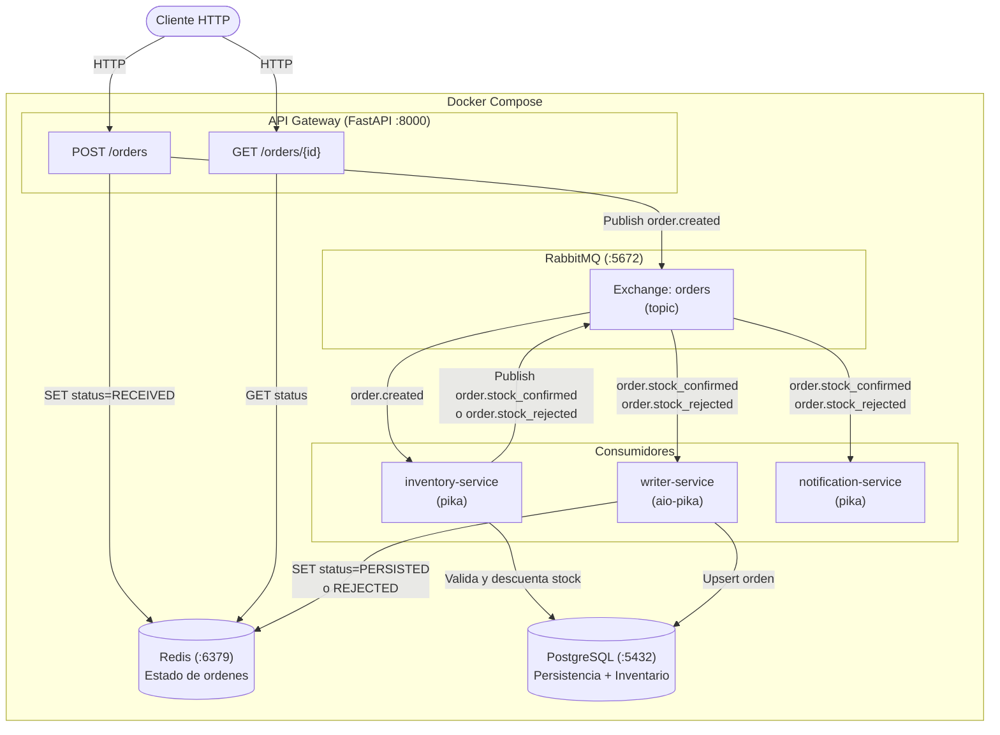
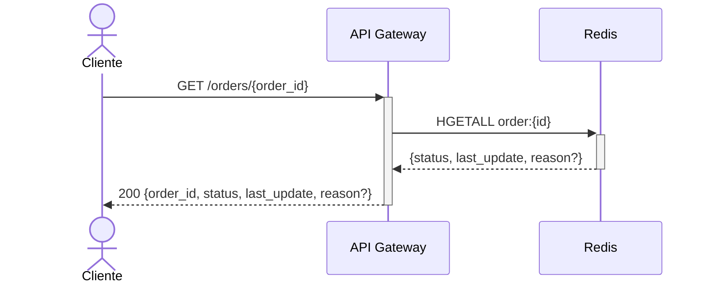

# Procesamiento Distribuido de Ordenes con RabbitMQ

Sistema event-driven de procesamiento de ordenes que utiliza **FastAPI**, **RabbitMQ**, **PostgreSQL** y **Redis**. Un API Gateway recibe ordenes por HTTP, las publica a un exchange topic de RabbitMQ, y tres consumidores procesan el evento mediante encadenamiento de eventos — `inventory-service` valida stock primero, y los servicios downstream reaccionan segun el resultado.

## Diagrama de componentes



## Diagrama de secuencia

### Crear una orden (POST /orders)

```mermaid
sequenceDiagram
    actor Client as Cliente
    participant GW as API Gateway
    participant Redis as Redis
    participant RMQ as RabbitMQ
    participant Inv as Inventory Service
    participant Writer as Writer Service
    participant Notif as Notification Service
    participant PG as PostgreSQL

    Client->>+GW: POST /orders {customer, items}
    GW->>GW: Genera order_id (UUID)
    GW->>Redis: HSET order:{id} status=RECEIVED
    GW->>RMQ: Publish order.created
    GW-->>-Client: 202 {order_id, status: RECEIVED}

    RMQ->>+Inv: order.created (auto_ack)
    Inv->>PG: Valida y descuenta stock (all-or-nothing)

    alt Stock disponible
        Inv->>RMQ: Publish order.stock_confirmed
        Inv-->>-RMQ: done

        par Consumidores downstream en paralelo
            RMQ->>+Writer: order.stock_confirmed
            Writer->>PG: Upsert orden (idempotente)
            Writer->>Redis: HSET status=PERSISTED
            Writer-->>-RMQ: ACK
        and
            RMQ->>Notif: order.stock_confirmed (auto_ack)
            Notif->>Notif: Log confirmacion al cliente
        end
    else Stock insuficiente
        Inv->>RMQ: Publish order.stock_rejected
        Inv-->>-RMQ: done

        par Consumidores downstream en paralelo
            RMQ->>+Writer: order.stock_rejected
            Writer->>Redis: HSET status=REJECTED, reason=...
            Writer-->>-RMQ: ACK
        and
            RMQ->>Notif: order.stock_rejected (auto_ack)
            Notif->>Notif: Log rechazo al cliente
        end
    end
```

### Consultar estado (GET /orders/{id})



**Ciclo de vida del estado:** `RECEIVED` → `PERSISTED` | `REJECTED` (stock insuficiente) | `FAILED` (error en BD)

## Requisitos previos

- [Docker](https://docs.docker.com/get-docker/) y Docker Compose

## Inicio rapido

```bash
# 1. Clonar el repositorio
git clone <url-del-repo>
cd rabbitmq-orders-distributed

# 2. Crear archivo de variables de entorno
cp .env.example .env

# 3. Levantar todos los servicios
docker compose up --build
```

## Uso

### Crear una orden

```bash
curl -X POST http://localhost:8000/orders \
  -H "Content-Type: application/json" \
  -d '{"customer": "Ana", "items": [{"sku": "LAP-001", "qty": 1}]}'
```

Respuesta (HTTP 202):

```json
{
  "order_id": "f47ac10b-58cc-4372-a567-0e02b2c3d479",
  "status": "RECEIVED"
}
```

### Consultar estado de una orden

```bash
curl http://localhost:8000/orders/{order_id}
```

Respuesta (orden exitosa):

```json
{
  "order_id": "f47ac10b-58cc-4372-a567-0e02b2c3d479",
  "status": "PERSISTED",
  "last_update": "2026-03-18T12:00:00+00:00",
  "reason": null
}
```

Respuesta (orden rechazada por stock):

```json
{
  "order_id": "f47ac10b-58cc-4372-a567-0e02b2c3d479",
  "status": "REJECTED",
  "last_update": "2026-03-18T12:00:01+00:00",
  "reason": "Stock insuficiente para SKU LAP-001 (disponible: 50, solicitado: 9999)"
}
```

## Servicios

| Servicio | Puerto | Descripcion |
|----------|--------|-------------|
| **api-gateway** | 8000 | Punto de entrada HTTP. Recibe ordenes, guarda estado en Redis y publica `order.created` a RabbitMQ |
| **inventory-service** | — | Consumidor bloqueante (pika). Valida y descuenta stock, publica `order.stock_confirmed` u `order.stock_rejected` |
| **writer-service** | — | Consumidor async (aio-pika). Persiste ordenes en PostgreSQL y actualiza el estado en Redis (`PERSISTED`/`REJECTED`) |
| **notification-service** | — | Consumidor bloqueante (pika). Registra la notificacion de confirmacion o rechazo al cliente |
| **PostgreSQL** | 5432 | Base de datos relacional para persistencia de ordenes |
| **Redis** | 6379 | Cache de estado de ordenes |
| **RabbitMQ** | 5672 / 15672 | Message broker. UI de administracion en `http://localhost:15672` (guest/guest) |

## Estructura del proyecto

```
rabbitmq-orders-distributed/
├── docker-compose.yml
├── .env.example
├── api-gateway/
│   └── app/
│       ├── main.py                 # Endpoints POST/GET /orders
│       ├── config.py               # Settings con pydantic-settings
│       ├── rabbitmq_publisher.py   # Publica eventos al exchange
│       ├── redis_client.py         # Cliente Redis async
│       └── schemas.py              # Modelos Pydantic de request/response
├── writer-service/
│   └── app/
│       ├── main.py                 # Consumer aio-pika + asyncio
│       ├── config.py               # Settings (DB + Redis + RabbitMQ)
│       ├── db.py                   # Motor SQLAlchemy async
│       ├── models.py               # Modelo ORM Order
│       ├── redis_client.py         # Cliente Redis async
│       └── repositories/
│           └── orders_repo.py      # Insercion idempotente
├── inventory-service/
│   └── app/
│       ├── main.py                 # Consumer pika + publicador de eventos
│       ├── db.py                   # Motor SQLAlchemy sync
│       └── models.py              # Modelo ORM Product (stock)
└── notification-service/
    └── app/main.py                 # Consumer pika bloqueante
```

## Variables de entorno

Definidas en `.env` (copiar desde `.env.example`):

| Variable | Descripcion |
|----------|-------------|
| `POSTGRES_USER` | Usuario de PostgreSQL |
| `POSTGRES_PASSWORD` | Contrasena de PostgreSQL |
| `POSTGRES_DB` | Nombre de la base de datos |
| `DATABASE_URL` | URL de conexion async para SQLAlchemy (`postgresql+asyncpg://...`) |
| `REDIS_URL` | URL de conexion a Redis |
| `RABBITMQ_URL` | URL AMQP de conexion a RabbitMQ |

## Comandos utiles

```bash
# Reconstruir un servicio especifico
docker compose up --build api-gateway

# Ver logs de un servicio
docker compose logs -f writer-service

# Detener todos los servicios y eliminar volumenes
docker compose down -v
```
